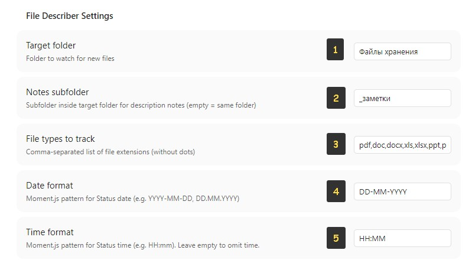

<p align="center">
  <a href="README.md">English</a> |
  <a href="README.ru.md">Русский</a>
</p>

# File Describer

An Obsidian plugin that automatically creates and manages description notes for files in a watched folder. Perfect for organizing files in your vault with searchable descriptions, tracking file changes, and managing metadata.

## Features

- **Auto-creation of description file** — when a file is added to the target folder, a companion description note is automatically created
- **Delete tracking** — when a file is deleted, its companion note automatically updates its status
- **Move tracking** — the `File` field in the companion note is automatically updated when the file is moved
- **Orphaned note handling** — when a file is deleted, you can keep the note for history or delete it
- **Badge indicator** — a red `!` on the ribbon icon indicates file changes that need attention
- **Recursive scanning** — files in the configured folder are scanned recursively regardless of nesting

<p align="center">
  
</p>


## Settings

1. **Target folder** — set the folder to monitor for files
2. **Notes subfolder** — set the folder where description notes will be stored
3. **File types to track** — file types to monitor
4. **Date format** — set a convenient date format
5. **Time format** — set a convenient time format

## How it works

1. Place a file in the target folder
2. The plugin creates a description note in the notes subfolder with frontmatter: `File Description`, `File` (wikilink), `date_added`, `filetype`, `filename`
3. When a file is added, deleted, or moved, a red `!` appears on the plugin icon
   
4. When you open the plugin, the required action is shown in the tabs
   
5. Fill in the "Description" and "Tags" fields, click "Save"

## Installation

### From Obsidian Community Browser

Search for "File Describer" in Settings → Community plugins → Browse.

### Via BRAT

1. Install the [BRAT](https://github.com/TfTHacker/obsidian42-brat) plugin
2. Add `https://github.com/Alexandrovdi/File-Describer` to the list of beta plugins
3. Click "Add Plugin"

### Manual

1. Download the latest release from [GitHub Releases](https://github.com/Alexandrovdi/File-Describer/releases)
2. Extract `main.js`, `manifest.json`, and `styles.css` to `VaultFolder/.obsidian/plugins/file-describer/`
3. Enable the plugin in Settings → Community plugins

## Development

```bash
git clone https://github.com/Alexandrovdi/File-Describer.git
cd File-Describer
npm install
npm run build    # builds main.js
npm run dev      # watch mode
```

## License

MIT
